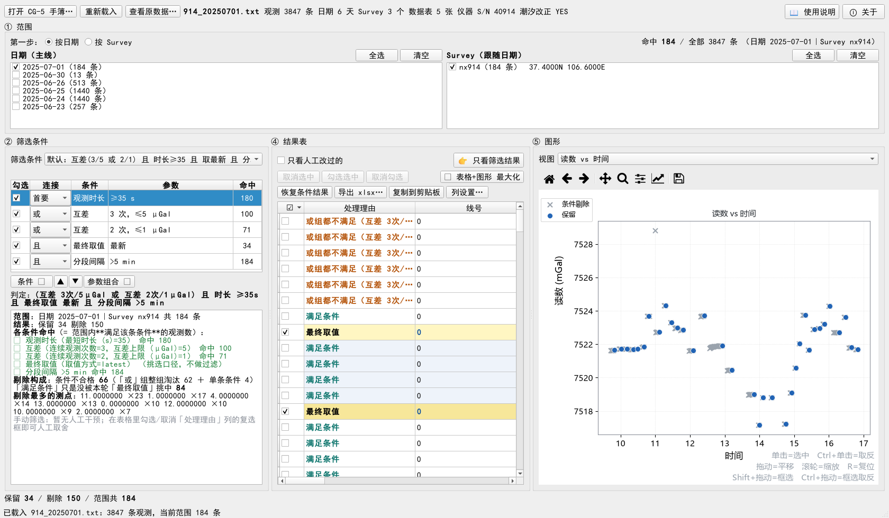

# CG5Picker — CG-5 重力仪数据挑选

[]()
[]()
[]()

**CG-5 原始手簿 → 按日期 / Survey 两条线圈范围 → 按条件筛选 → 图形上人工复核 → 按原始数据格式导出 xlsx。**

从 `GravProc`（大软件"观测挑选工作台"）**独立出来**的小软件：只做"挑选"这一件事，
双击即用，**默认最大化启动**。

- **两条线定范围**：按日期 或 按 Survey，另一边自动跟随；两边**取交集**，缺一边就是 0 条
- **条件栈**：观测时长 / 相邻互差 / 分段间隔 / 最终取值，可 **且 / 或** 分组，参数组合可存可换
- **逐轮挑选**：同一测点按时间分段，**每轮单独给「最终取值」**
- **图形复核**：测点分布 / 观测值 / 仪器潮汐 / 理论固体潮 / 互差，缩放、平移、框选、悬停读数
- **人工复核留痕**：手动勾选或剔除**逐条记理由**，一键「只看人工改过的」
- **导出 xlsx**：列序可调；日期时间是**真日期真时间**、编号保留原文小数、可附 Survey 文件头
- **全程离线**；配置写在**安装目录**（不是 C 盘系统目录），不污染用户目录



> **不写代码也能用**：Windows 安装包 `CG5Picker_Setup_v1.0.0.exe`（44.9 MB，装完即用，**不需要 Python**）
>
> - [GitHub Releases](https://github.com/pengzhenran/CG5Picker/releases/latest)（海外）
> - **夸克网盘**（国内更快）：<https://pan.quark.cn/s/615510f3f836>
>
> 课题组公众号与网盘二维码见文末「**关注与获取**」。

---

## 安装（终端用户，推荐）

下载 `CG5Picker_Setup_v1.0.0.exe` 双击按向导安装：

- 默认**按用户安装**（不弹管理员）到 `%LOCALAPPDATA%\Programs\CG5Picker`，向导里也能改到别的盘；
- 开始菜单生成 `CG5 数据挑选` / `使用说明 (HTML)` / `作者信息` / `许可与第三方声明` / `卸载`，可选桌面快捷方式；
- **不需要装 Python**：Python 运行时、Qt、绘图库都在安装目录里；全程离线；
- 安装目录**可写**，所以窗口、条件栈的记忆（`config\settings.json`）存得下来；
- 装完双击图标即用，界面里 **F1 = 使用说明**、**Shift+F1 = 关于**。

> 首次运行可能被 Windows 拦下（程序与安装包都**没有代码签名**）：
> 「Windows 已保护你的电脑 / 未知发布者」→ 点**更多信息 → 仍要运行**；
> Windows 11 的「智能应用控制」若拦下，只能在 设置 → 隐私和安全性 → Windows 安全中心 →
> 应用和浏览器控制 → 智能应用控制 里关掉它（没有单应用白名单，换目录、重装都绕不过），
> 关掉它不影响 Defender 的病毒防护。

## 源码运行（开发 / 二次开发）

```powershell
git clone https://github.com/pengzhenran/CG5Picker.git
cd CG5Picker
python -m pip install -r requirements.txt
python main.py                       # 打开界面
python main.py "D:\某天\914_xxx.txt"   # 打开并直接载入某个手簿
```

也可以双击 **`启动_CG5数据挑选.bat`**：内容纯 ASCII，按顺序找 `.venv\Scripts\python.exe`
→ `..\GravProc\.venv\Scripts\python.exe`。

依赖：`PySide6-Essentials matplotlib numpy openpyxl`（缺哪个 `main.py` 会直接报出解释器和该装什么）。
界面**只用 PySide6-Essentials + matplotlib**，不装完整 `PySide6`（避免带进 GPL-only 的 Qt 模块），
理由见「⑨ 版权与许可」。

---

## ① 范围：**先选主线，另一条线自动跟随**

**第一步先决定按哪条线走**（左上角两个单选），然后**横向两块**：左边是主线（全部可选、
可多选），右边自动列出与左选对应的另一条线。

| 主线 | 左边（你勾的） | 右边（自动跟随） | 默认 |
|---|---|---|---|
| **按日期** | 日期列表（最新在前） | 这些天上出现过的 **Survey** | 最新一天；右边**全选** |
| **按 Survey** | Survey 列表 | 这些 Survey 出现过的 **日期**（最新在前） | 最新那天的 Survey；右边**只勾最新一天** |

- **两条线是「且」（求交集）：两边都要有勾选，缺一边就是 0 条**。
  > 这条是踩过坑才改的：以前"空 = 这条线不筛选"，于是把日期「清空」会**突然变成
  > 整份文件都进来**（用户报的"全部取消，反而选中全部"），把 Survey 全取消也不会
  > 让数据变少（"取消 survey 选择，数据没取消"）。现在缺哪条线，右上角与汇总框
  > 都会点名："还没有勾日期 / 还没有勾 Survey（两条线求交集：缺一边就是 0 条）"。
- **改左边的勾选 → 右边整块重建**：按日期改成哪几天，右边就是那几天的 Survey（默认全选）；
  按 Survey 改了 Survey，右边就是这些 Survey 的日期（默认只勾最新一天）。
- **左边清空 → 右边也清空**（→ 0 条）。这是故意的：
  免得留下"暗中的过滤条件"，也免得清空反而放大范围。
- 两块的**条数都按对方当前勾选统计**（`nx914（184 条）` 而不是整份文件的 3650 条）。
- **Survey 列表项后面带该 Survey 的经纬度**（`nx914（184 条）　37.4000N 106.6000E`）——
  同一文件里不同 Survey 的坐标可以完全不同，摆在列表里一眼能看出这一项用的是哪套坐标
  （固体潮就是按它算的）。
- 右上角实时显示 **名称**：`命中 184 / 全部 3847 条（日期 2025-07-01｜Survey nx914）`
  —— 选得多时显示 `全部 N 天` 或 `前两个 等 N 个`。
- 每一块自带 `全选 / 清空`。

> 一个 CG-5 导出文件常含**多天、多 Survey**。文件名叫 `914_20250701.txt`
> 不代表只有 7 月 1 日 —— 实测该文件含 6 天；`914_20250711.txt` 含 **15 天 / 7 个 Survey**。

---

## ② 筛选条件：参数组合 + 条件栈

### 「筛选条件」下拉 = **存储的条件参数组合**（下拉已加宽，长名字看得全）

- 一个组合 = **一整条条件栈**（每条条件的类型、参数、勾选状态、**连接词**）。
- **切换组合 → 整条栈被替换，而且全部勾选，立即生效。**
- 右侧只有一个 **`参数组合 ▾`** 按钮，菜单里是：**存参数 / 重命名 / 删除**
  （自定义组合落在 `%APPDATA%\CG5Picker\presets.json`，跨次启动还在；
  **内置 4 个**组合不能改名/删除）。`Ctrl+S` 也可存参数。
- 下拉下方提示"当前条件栈 = 组合 X"或"已不同于组合 X"（比对时含连接词）。

### 条件栈：增 / 改 / 删 / 移 / **或且**都在栈里

表格下方一排按钮：`条件 ▾`（菜单：**添加条件… / 改参数… / 删除**）、`▲`、`▼`、
`参数组合 ▾`；**右键**条件行同样可用；双击行 = 改参数。

- 条件表五列：`勾选｜连接｜条件｜参数｜命中`。**铺满面板、没有横向滚动条**：
  | 列 | 宽度 | 说明 |
  |---|---|---|
  | 勾选 | 自适应 | ☑ 复选框 |
  | **连接** | **2 个汉字** + 下拉框箭头/内边距（约 78px） | 首要 / 或 / 且 |
  | **条件** | **4 个汉字** | `最终取值`、`分段间隔` 正好占满 |
  | **参数** | **最多 16 个汉字**（富余宽度都给它） | 至少放得下当前最长的参数写法（不省略号） |
  | 命中 | **剩下的宽度**（≈54px，只留得下表头 + 三四位数字） | 用户："命中列缩短" |
  - 实测（② 面板 500px、视口 474px）：`[38, 78, 70, 234, 54]`，**和 = 474 = 视口**，滚动条不可见。
  - 「命中」的宽度是**自己算的**，不用 `Stretch`/`stretchLastSection` ——
    程序化改列宽时那个"拉伸段"不跟着重算，五列之和会比视口宽、右边被切掉一截（实测差 46px）。
  - 窗口/分隔条一变宽，列宽跟着重算（视口 resize 事件 + `resizeEvent`），
    所以**任何尺寸下都铺满、都不出横向滚动条**（用户："怎么现在又变成需要左右滑动了，
    铺满就行，不要左右滑动"）。
- **竖向分配：上面（条件表）减小、下面（日志）加大**（用户口径）。
  条件表的最高高度 = **现有条件 + 1 行**（最少 5 行、最多 8 行），超出的行滚动；
  剩下的高度按 **日志 2 份 : 条件表 1 份** 分配，日志另有 120px 保底。
  实测（② 面板高 1040px）：**5 条条件 → 条件表 214px / 日志 636px**
  （改前是 条件表 567px / 日志 283px）；条件加到 8 条时条件表 274px / 日志 556px。
  表下方实时写出**判定式**，例如
  `判定：(互差 3次/5μGal 或 互差 2次/1μGal) 且 时长 ≥35s` —— 或/且一眼看清。

#### 「连接」列：首要 / 或 / 且（这是两块结构）

| 连接 | 角色 | 判定 |
|---|---|---|
| **首要** | 第一块：**首要条件** | 勾上的**都必须**满足 |
| **或** | 第二块：或组 | 这一组里**至少一条**满足 |
| **且** | 第二块：且组 | 这一组里**每条都**满足 |

**判定 = 首要 ∧ (或组) ∧ (且组)**，空组不参与。改连接词**立即重算**。

- 全是「且」→ 与老口径完全一致（交集），老预设 JSON（没有 link 键）读进来就是「且」。
- 「或」组全都不满足的观测，处理理由写成整组：`或组都不满足（互差 3次/5μGal ｜ 互差 2次/1μGal）`。

> **踩过的坑**：`添加条件…` 曾经**点了没反应** —— `window.py` 漏了
> `QListWidget / QListWidgetItem` 两个 import，`_PickKindDialog` 一构造就 `NameError`，
> 而异常闷在 Qt 槽里（命令行窗口在主窗口后面，看不到 traceback）。
> 现在自检里专门有两条盯着它：对话框建得起来、条件真的进栈。

**默认（用户指定，内置组合第一个）**：

```
(互差 连续3次/5μGal  或  互差 连续2次/1μGal)  且  观测时长 ≥35 s
                        且  最终取值 = 最新  且  分段间隔 > 5 min
```

| 连接 | 条件 | 参数 | 含义 |
|---|---|---|---|
| 首要 | 观测时长 | `≥35 s` | 时长 ≥35 s（**必须先过这一关**） |
| 或 | 互差 | `3 次，≤5 μGal` | 同一测点**最后 3 次**极差 ≤5 μGal → 这 3 个读数都算"满足" |
| 或 | 互差 | `2 次，≤1 μGal` | 同上，只要求 2 次且限差 1 μGal |
| 且 | **最终取值** | `最新` | 在已满足的读数里，每一轮只留一条（可改「最小距平」） |
| 且 | **分段间隔** | `>5 min` | **多少分钟以上算新的一轮**；自己不剔除任何观测 |

> ★ 用户口径（本轮）："最终取值里参数里有个**分段间隔**，这个要**单独出来**，
> 是个'**且**'连接。" —— 于是它从「最终取值」的参数里拆成了**独立一条**：
> 界面上看得见、能改，判定式里也写得出来
> （`… 且 最终取值 最新 且 分段间隔 >5 min`）。
> **判定结果完全不变**（自检里比过：拆条前/后保留的观测一模一样）；
> 老预设 JSON 里还写着 `final_pick.gap_min` 的，读入时会自动拆成两条
> （`rules.migrate_conds`）。

其余可加：最少观测次数、标准差上限、倾斜上限、REJ=0、温度区间、观测时间间隔、**独立观测间隔（同点相邻间隔 >5 min 才算独立观测）**、**分段间隔**。
勾选/取消**立即生效**。

#### 「最终取值」—— 判定与取值分开

| 取值方式 | 选哪一条 |
|---|---|
| **最新**（默认） | 该**观测轮次**里合格读数时间最晚的那一条 |
| **最小距平** | 离**这一轮合格读数的均值**差值最小的那一条；**只有两个读数时取最新一个** |

> **互差判定口径（两步：先判定、再取值）**：
> 1. 按 **点号（+线号）** 在选定范围内**分组**（组内按时间排序）；
> 2. **滑动窗口**：对整段序列逐个取连续 n 次，极差 ≤ 限差 → **这 n 个读数都标成"满足条件"**；
> 3. 按 **观测轮次** 切分：同一测点相邻两次观测的**时间间隔 > 5 min** 就换一轮
>    —— 这个 5 min 就是**「分段间隔」**那条条件的参数，改它即可；
> 4. 由「最终取值」在**每一轮的**满足读数里挑一条（默认最新）。
>
> 也就是现场做法：**"满足条件的 3 个数中，最后选择最后一个数。"**
> **一个轮次留 1 条**：一天只测一轮的点留 1 条；一天测了两轮（早/晚复测）就留 2 条
> —— 这是用户口径，早期"一个测点一天只留 1 条"会把下午复测也吞掉。
> 某一轮观测次数不足 n 次 → 这一轮不保留（无从判定），不影响别的轮次。
>
> 为什么把"取值"从互差里拆出来：挑选口径要能参数化（最新 / 最小距平），
> 写死在互差里就换不了。判定的条数也因此变成"窗口内全部"（命中 39 而不是 13）。
>
> **为什么是滑动窗口而不是"只看最后 n 次"**（用户实测踩到）：
> `1465_20250702.txt` 线0/点0 一天测了 11 次，其中
> `06:59:55` 与 `07:01:00` **两次读数完全相同**（6822.267，互差 0 μGal）——
> 它们明明满足"连续 2 次互差 ≤1 μGal"，却因为合格窗口出现在序列**中间**而被
> 判成「或组都不满足」。现在逐窗口判定：这两条标成"满足条件"，
> 而 **最终取值=最新 仍然挑到该轮最后那次**（07:33:06）—— 结论不变、理由对了。
>
> **为什么还要按轮次切**（用户实测踩到，第二轮）：
> 同一天上午 06:40~07:42 测了 4 轮、下午 17:08 又测 1 轮，
> 早先"一个测点一天挑 1 条"只给下午那条挂上「最终取值」，
> 上午几条明明是各自轮次的合格末次，却只能显示"满足条件"。
> 现在 `1465_20250702.txt` 线1/点0 的 5 轮全部标「最终取值」：
> `06:40:59 / 06:55:53 / 07:25:10 / 07:42:01 / 17:08:22`；
> 线0/点0 的 3 轮：`06:47:42 / 07:01:00 / 07:33:06`。
>
> 两个踩过的坑：
> · **不按"文件里连续的行段"分组** —— 手簿里同一测点可能被观测两轮
>   （`1,1,1, 3,3,3,3,3, 1,1`），按行段切会劈开它，凑不够 n 次而误剔整批。
> · **不是**"滑动窗口把窗口内 n 条全部保留" —— 那样同一点会留下多条，
>   下游段差/平差里同一点出现多个值，语义不清。

---

## ③ 结果表：默认显示全部数据，筛出的打勾

- **最左边两列固定为「☑ 勾选框」+「处理理由」**，复核时不用横向滚动。
- **「处理理由」列**（用户口径：满足条件的也要写清楚，用**不同颜色**区分）：
  | 行 | 写什么 | 字色 |
  |---|---|---|
  | 保留、且是「最终取值」挑中的那条 | **`最终取值`** | 保留行蓝（加粗） |
  | 保留、其它（没挂「最终取值」时） | `满足条件` | 保留行蓝（加粗） |
  | **本轮通过了条件、只是本轮的「最终取值」挑了另一条** | `满足条件` | **青色 `#0f766e`**（不算被剔除） |
  | 被某条条件剔除 | 那条条件的完整描述 | 琥珀 `#b45309` |
  | 被或组整组淘汰 | `或组都不满足（互差 3次/5μGal ｜ 互差 2次/1μGal）` | 琥珀 |
  | 手工改过 | 上面再拼 `（人工复核）` | 红 `#b91c1c` |
  | 范围外 | `范围外` | 灰 |
- **「命中」= 满足该条条件的观测数**（不是被它剔除的数量 —— 那会让"时长"看着像 0）。
  两条"不剔人"的条件另按各自口径写：
  - **最终取值** → **被它挑中的条数**（写"满足条件的条数"会显示 0，因为挑剩下的都归"满足条件"了）；
  - **分段间隔** → 范围内**全部**观测（它只定分轮口径，不剔除任何观测）。
- **日志里有「剔除构成」一行**，把两类"没保留"分开数：

  ```
  剔除构成：条件不合格 66（「或」组整组淘汰 62 ＋ 单条条件 4）
            「满足条件」只是没被本轮「最终取值」挑中 84
  ```

  > **为什么加这一行**（用户实测提问："为什么观测时长 连接改为『或』，就全都满足了？"）：
  > 「或」= 组里**任意一条**满足就放行。时长是最松的一条（184 条里 180 条 ≥35 s），
  > 它一进「或」组，或组几乎恒真 —— 实测 `条件不合格 66 → 2`、
  > `满足条件 84 → 148`，于是处理理由列上几乎全是青字"满足条件"，看着就像全放行了。
  > **注意**：光看「命中」列发现不了（命中 = 该条件满足的条数，与连接词无关），
  > 一定要看这一行或表格的「处理理由」列。宽松条件（时长/REJ/倾斜这类"每轮都该满足"
  > 的常规要求）应该用**首要/且**当门槛；「或」留给"多种判据任选其一"（例如两条互差）。
- **行底纹（四种颜色）**：
  - **打勾（挑出来）的行 = 淡黄底**，仍是**两个黄交替**（`#fff6c2` / `#f7e79a`）——
    既一眼看出"哪些是挑出来的"，又保留"相邻测点换色"的分组信息；
    整批同一个黄会让相邻测点糊成一片，等于把分组信息做废。
  - 没打勾的行仍按测点交替**白 / 浅蓝**（`#ffffff` / `#eef3fa`）。
  - 换色只可能有两个原因：**换测点**、或**这一行的打勾状态变了**（自检里逐行核对过）。
- **打勾的行文字换成蓝色并加粗**（淡黄底上对比度 6.4~7.3 : 1）。
- **表格里被点击选中的行 = 亮黄高亮**（`#ffc400`，文字压成近黑，对比度 11.6 : 1），
  比打勾的淡黄更饱和，所以"当前定位在哪一行"一眼可辨。
  > 这条**不是**用调色板 `Highlight` 实现的：实测本机 Windows 11 样式在窗口**非激活**时
  > 会把选中行画成几乎看不出来的浅灰（抓像素 `(245,236,186)`，而调色板里明明是 `#ffc400`）。
  > 也不用样式表 —— 样式表会接管整张表的绘制，把上一条的底纹一起顶掉。
  > 现在由一个 `QStyledItemDelegate` 自己铺底，激活与否都是同一个亮黄。
- **默认显示全部数据**（范围内的导入数据全部列出，**筛出来的打勾、被剔除的不打勾**，
  与之前软件一致）；**`👉 只看筛选结果`** 按钮在两种模式间切换（按钮文字随模式变化）。
  > 原来左边还有个「显示全部数据」复选框、右边又有这个切换按钮 —— 重复，**复选框已去掉**，
  > 状态只在右边的按钮上体现。
  >
  > **「只看筛选结果」时，表里的「☑」和「处理理由」两列会隐藏**（那一屏全是保留的，
  > 这两列没有信息量），复制也跟着不带；**图形也把被剔除的点藏起来**（见 ④ 图形）。
  > 「只看人工改过的」不算：那一屏正是要复核勾选与理由的，两列照常显示。
- **按钮分三排**（都挂在结果表这一块）：
  - 第 1 排：`只看人工改过的`、`👉 只看筛选结果`
  - 第 2 排：`取消选中`、`勾选选中`、`取消勾选`、（右端）`⛶ 表格+图形 最大化`
  - 第 3 排：`恢复条件结果`、`导出 xlsx…`、`复制到剪贴板`、`列设置…`

  > ★ 用户口径（四轮）：
  > · "结果表上再加一个取消选中，勾选选中，反选选中。全选和全不选 取消掉，
  >   这两个按钮没什么用处。" → 旧的 `全选 / 全不选`（作用于**整个范围**）已删。
  > · "**取消选中的意思是取消表格行的选中，不是取消勾选，勾选和选中是两回事**，
  >   再加一个取消勾选，把 反选选中取消掉。" → 语义已改正，`反选选中` 已删。
  > · "是**同时最大化，表格和图形，两者绑定**。按钮放在只看筛选结果的下面。"
  >   → 两个单独的最大化按钮合成**一个**。
  > · "不要四排就三排，**最大化和选中操作在一排，不冲突**。"
  >   → 合并成三排：最大化按钮放在第 2 排右端（仍在 `只看筛选结果` 正下方、右对齐）。
  >
  > | 按钮 | 动什么 | 不动什么 |
  > |---|---|---|
  > | `取消选中` | **表格的行选中**（放开高亮，图上高亮与"查看原数据"同步清掉） | 勾选状态一个都不动 |
  > | `勾选选中` | 选中行的**勾选** = 人工保留 | 行选中不动 |
  > | `取消勾选` | 选中行的**勾选** = 人工剔除 | 行选中不动 |
  > | `⛶ 表格+图形 最大化` | 只切换窗口，**不碰选中也不碰勾选** | 选中、勾选都不动 |
  >
  > · **没选中行时前三个都置灰**（最大化按钮任何时候都能点）；
  > · 勾选类操作完**多选会保留**，可以接着点下一个按钮；
  > · 每排宽度都 ≤430px，实测 1400（④ = 430px）/ 1680 / 2560 三个宽度下
  >   **没有一个按钮超出面板**。
  >
  > 想清空表格选择还有两个入口：图形里点空白处、结果表右键「取消表格选中（清空选择）」。
- `⛶ 表格+图形 最大化`：把 ④ 结果表与 ⑤ 图形**一起**放进**一个**独立窗口并最大化
  （左表右图，中间的拖动条可以再分配宽度）。两块是**绑定**的：一起出去、一起回来。
  做法是 **reparent 同一批面板**（不是复制界面）—— 表格还是那张表、图形还是那个画布，
  勾选、行选中、图形缩放平移**全部原样保留**；关掉那个窗口（或点窗口里的
  `⤡ 放回主窗口`）两块就塞回原来的栏位（表 = 第 2 栏、图 = 第 3 栏），三栏宽度也还原。
  实测（2560×1369）：独立窗口里表 **1177px** / 图 **1374px**（画布 1352×1260）；
  关掉后主窗口分栏回到 `[500, 862, 1172]`。
- `只看人工改过的`：只看你手工动过的观测。
- **表头排序只对数据列起效**：点「☑」或「处理理由」不会排序（表头有提示说明），
  其余列可排，**数值列按数值排**（`10` 排在 `9` 之后，不是字典序），空值排最后。

### 复制到剪贴板（Ctrl+C）

- **列与表格里看到的完全一致**：最前面就是「☑」和「处理理由」，然后是当前列序的数据列
  （以前理由列被甩到最后、勾选框列干脆没有）。
- **有选中的行 → 只复制选中的行**；没选 → 复制当前全部可见行（按表格里的顺序，含排序结果）。
  在表里按 `Ctrl+C` 是**整行**复制，不再只复制点到的那一格。
- 「☑」列写 `☑` / 空，其余列与表格显示一致（编号去零、数值按显示规范）。
- 「只看筛选结果」时表里没有这两列，所以复制也不带它们。

### 手动筛选（表格 ↔ 图形双向同步）

- 勾选/取消「☑」列的复选框 = **人工保留 / 人工剔除**，理由列标注"（人工复核）"，导出可带出。
- **右键**菜单：人工保留 / 人工剔除 / 恢复条件结果（作用于选中行；没选中则作用于当前可见行）、
  在图上定位、恢复图形全览、复制选中的观测、查看原数据。
- **用户显式做过的决定一律记入台账**，即使结果与自动判定相同也不会被静默丢弃。
- 动动表头可改列顺序（导出/复制都跟随；勾选框与理由列固定在最左，不参与重排）。

### 线号 / 点号的显示规则

仪器把编号写成浮点（`0.0000000`、`1110.0000000`）：

| 原文 | 显示 | 规则 |
|---|---|---|
| `0.0000000` | `0` | 整数 → 去零 |
| `12.5000000` | `12.5000000` | **有小数 → 原样保留**（不截断、不四舍五入） |
| `1A` / `L-3` / `2+3` | 原样 | **含字母或符号 → 原样字符串** |
| `1e5` / `1,000` | 原样 | 非"纯数值"字面量 → 原样 |

悬停单元格可看**原文**。原始字符串始终保留在 `ObsRow.cells` 里，
导出、分组、筛选一律用原文。

---

## ④ 图形：四种视图 + 完整交互

| 视图 | 看什么 |
|---|---|
| 读数 vs 时间 | 漂移、跳变 |
| 互差带（按测点居中） | 相对各自测点中位数，叠加 ±5 / ±1 μGal 限差带 |
| 倾斜 / 温度 vs 时间 | 仪器状态 |
| 仪器潮汐 vs 理论潮汐 | 潮汐改正是否合理（理论值按 DZ/T 0082-2021 附录 H 规范公式现算） |

> **理论固体潮的坐标与日期是「逐行」取的**：每一行用**自己所属 Survey 头里的经纬度**
> 和**自己的日期 + 时刻**去算。原因是同一文件里不同 Survey 的坐标可以完全不同
> —— 实测 `914_20250701.txt`：`914` = 30.5N/114.4E，而 `nx914` = 37.4N/106.6E。
> 早期实现只在"恰好只选中一个 Survey"时才去查坐标，而且传给绘图层的日期是**空串**，
> 两者一叠加，曲线**永远算不出来**（界面上只能看到"理论潮汐（无经纬度算不了）"）。
> 现在实测：理论曲线与仪器自带的潮汐改正在同日数据上 **r = 0.9997~0.9999**。
>
> （缓存键里**必须带小时**：只按"日期 + 坐标"缓存会把一整天算成同一个常数 ——
> 这个 bug 是自检里量到"理论值 min == max"才发现的。）

**交互**（与 GravProc 一致并补全）：

| 操作 | 效果 |
|---|---|
| **鼠标移到散点** | 在**图形框内左下角、坐标轴之外**显示该观测信息（点号/线号/读数/标准差/时长/时刻/倾斜/Survey）。线号点号与表格显示规范一致；**不含温度与源行**；不拉伸坐标系 |
| **单击散点** | **只选中**（在表格里定位），不改保留状态 |
| **Ctrl + 单击散点** | 该观测**取反**（剔除 / 取消，与表格勾选同一套人工复核账） |
| **左键动动** | 平移 |
| **滚轮** | **以光标下的那一点为中心**缩放（放大缩小都不跑偏） |
| **R** | **复位**：回到全览（工具条 ⌂ 同一个动作） |
| **Shift + 动动** | **框选**，选中的观测在表格里同步选中 |
| **Ctrl + 动动** | **框选并整批取反**（保留的剔除、剔除的保留）—— 橡皮筋显示为红色 |
| **表格选中行** | 图上**实心红点 + 红圈**高亮（四种视图都生效，画在最上层） |
| 工具条 | 复位 / 上一个视图 / 下一个视图 / 平移 / 缩放 / 保存图片（已中文化，**按钮上不再有悬停提示**） |

**"保留的点"是主角**：保留（条件）= 蓝色实心圆、**符号最大**、白描边、画在**最上层**
（zorder 6/7）；被剔除的 × 画在它下面（zorder 3）；表格选中再压在最上面（zorder 9/10）。

**图形跟着表格的显示模式走**：

| 表格 | 图形 |
|---|---|
| 显示全部数据 | 保留 / 条件剔除 / 人工剔除 / 范围外 **都画**（三态着色） |
| 👉 只看筛选结果 | **只画保留的点**；被剔除的连 `_pts` 一起藏掉 —— 看不见的点不该还能悬停/点中/框选 |

**这套操作说明直接写在图上**（图形**右下角**、坐标轴之外，11pt），包括 **R = 复位**：

```
单击=选中　Ctrl+单击=取反
拖动=平移　滚轮=缩放　R=复位
Shift+拖动=框选　Ctrl+拖动=框选取反
```

> 为什么不放标题里：标题块一变高就得多留上边距，而坐标轴的**比例**必须恒定
> —— 试过"按标题高度反算上边距"，自检当场抓到"平移期间坐标轴几何变了"。
> 放下方那条边距里，高度只跟字号有关，任何图高都放得下。
> 分三行是因为 11pt 下两行里最长那行比图还宽（实测左沿跑到 -80px）；工具条的
> 按钮提示已清空。

> **滚轮缩放的锚点必须走 matplotlib 自己的坐标换算**：Qt 的 `event.position()`
> 是**逻辑**像素、y 轴向下，而 `transData` 要**物理**像素、y 轴向上。
> 早期实现直接拿 Qt 坐标喂 `transData`（既没乘 `devicePixelRatioF()` 也没翻转 y），
> 锚点两轴都错 —— 表现就是"滚轮放大不是以鼠标为中心，很奇怪"。
> 现在统一走 `canvas.mouseEventCoords()`：实测缩放前后，光标下那一点的像素漂移
> **0.00 px**（旧算法会跑掉 125.4 px）。
>
> **R 同时挂在画布和窗口上**：滚轮缩放**不会**让画布拿到焦点（焦点还在刚点过的按钮上），
> 只挂画布就会出现"按 R 没反应"。窗口级快捷键在焦点落进文本框时会自动让开，
> 不影响输入。

> **动动按"像素位移"驱动，不看数据坐标**：鼠标一旦动出坐标轴范围，
> matplotlib 会把 `xdata/ydata` 置空。若按数据坐标算位移，就会在那一刻
> **静默停住**（表现正是"动着动着就不动了、疯狂抖"）。改成像素位移后，
> 鼠标移到哪儿视图都跟得上；实测被动的点与光标偏差恒为 **0.00 px**、
> 范围全程单调、无反向。
>
> **"点击"和"框选"不会互相打架**：按下的那一刻只进入"待框选"状态，
> **真的移动了**才开始画橡皮筋。否则 `Ctrl+单击`（取反）会被误当成框选。

### 视野（缩放 / 平移）什么时候会被重置

程序把"**全览**"和"**当前视野**"分成两个量：
勾选、Ctrl+单击取反、表格选中、修改条件——这些都只是"同一批点的显示状态变了"，
**视野原样保留**；只有换文件、换日期/Survey 范围、换图形视图时才重新全览。
工具条的「复位」始终回到**全览**（不是回到上次缩放的位置）。

> **交互期间几何固定**：图形**不用** matplotlib 的 constrained layout ——
> 它会在每次重绘时按刻度文字宽度重算边距，动动时坐标轴被反复拉伸收缩，
> 整个画面肉眼可见地抖动（实测一次动动里坐标轴宽度出现 4 个不同取值）。
> 现在用固定边距，动动/缩放时几何完全不动，只有数据在动。

**五态着色**：保留（条件，蓝点）、**人工保留**（青菱形）、条件剔除（灰 ×）、
人工剔除（红 ×）、范围外（淡灰点）。

---

## ⑤ 查看原数据（F3）

`查看原数据…` 按钮（或 `F3`、或结果表右键）打开一个**独立预览窗口**：

- **显示原始手簿全文**（带源行号），不做任何解析/格式化 —— 用来核对解析结果、看手簿头。
- **跟随表格选中**（默认勾，这是本窗口的主要用法）：结果表里点哪一行，预览就自动滚到
  对应源行并**高亮**（黄底）。
- **查找**：输入关键词回车即查，`下一个 / 上一个`，`清空`（在查找框里按 **Esc** 也清空）；
  勾上「只看命中行」只显示包含关键词的行。
- `◀ 上一条 / 下一条 ▶`：在**表格里选中的多条观测**之间逐条走（左下角写「第 2 / 3 条　源行 506」）。

> ★ 用户口径（本轮）："第一条、上一条、下一条、末一条 感觉这些功能没用。"
> 实测：**只选中 1 条时这四个按钮点了都纹丝不动**（`goto_selected` 边界收拢），
> 只有表格里 **Ctrl / Shift 多选**几条后才有得跳。所以：
> · `第一条 / 末一条` 功能上等于"连按几次上一条/下一条" → **已删**；
> · `上一条 / 下一条` **没得跳就置灰**（首条不能退、末条不能进），
>   并在左下角写清楚"已选中 1 条观测…表格里 Ctrl/Shift 多选后可逐条走"，
>   不再"点了没反应、看着像坏了"；
> · `只看命中行` 在**没输关键词时是死的** → 现在也置灰 + 提示"先输入关键词"。

---

## ⑥ 导出 xlsx

第 1 行表头 + 第 2 行起数据，**去掉每行开头的空格**。

**单元格类型**（用户："除了时间和日期都是文本类型，不方便" → 日期写文本后
WPS 又提示"该数据未识别为日期"）：

| 列 | 写成 | 例 |
|---|---|---|
| 数值列（读数 / 标准差 / 时长 / 倾斜 / 温度 / 潮汐 / REJ / 高程 / 十进制时间 / 地形） | **数值**（Excel 里能直接求和、排序） | `7432.742` |
| 编号列（线号 / 点号） | 先按显示规范**去零**；去零后是**纯数字就写数值**，并保留原文的小数位数 | `15.0000000` → 数值 `15`；`12.5000000` → 数值 `12.5` + 格式 `0.0000000`（显示回原样）；`1A` → 文本 |
| **时刻** | **真时间**（`datetime.time`）+ 格式 `hh:mm:ss` | 显示仍是 `19:43:18`，但能排序/做差 |
| **日期** | **真日期**（`datetime.date`）+ 格式 `yyyy/mm/dd` | 显示仍是 `2025/06/23`，但 Excel 认它是日期 |
| 其余 | 文本 | 原样 |

> 为什么日期不能留文本：WPS/Excel 会给文本日期打绿三角："该数据未识别为日期，
> 可能影响日期筛选、排序、运算等功能"。改成真日期后**显示一模一样**（靠数字格式），
> 但日期筛选、排序、`=B-A` 做差都能用。原来那行"写成数值会变一串小数"的担心，
> 说的是**不设数字格式直接写序列号**；设了 `yyyy/mm/dd` / `hh:mm:ss` 就不存在这问题。

| 格式 | 列 | 用途 |
|---|---|---|
| **原始数据格式**（默认） | 按原始列头**原顺序**，全部 15 列 | 字面意义的"原始格式"，可归档/替换手簿 |
| **自定义列序** | 按界面**列设置**的列与顺序 | 只带出关心的几列 |

- 导出内容：**仅保留的观测**（默认）或范围内的全部观测。
- 可勾选**附「处理理由」列**、**附 Survey 文件头**。
- **Survey 文件头写在表格最上面**（不是加一列）：把这些观测所属 Survey 的文件头字段
  排在上面，空一行再接数据表头 —— 冻结窗格也跟着下移到数据表头之下。
  字段**标签是原文**，值按类型写（用户："SN 应该是数值，整数。Date 也提示未识别为日期。
  ZONE 和 GMT DIFF 也应该是数值，非文本"）：

  | 字段 | 写成 |
  |---|---|
  | `Survey name` / `Client` / `Operator` | 文本 |
  | `Instrument S/N` | **整数**（`41465`，不再带绿三角） |
  | `ZONE` | **数值** | 
  | `GMT DIFF.` | **数值**，格式 `0.0` → 显示 `-8.0` |
  | `Date` | **真日期** `yyyy/mm/dd`（手簿里的 `2025/ 7/ 1` 也认） |
  | `Time` | **真时间** `hh:mm:ss` |
  | `LONG` / `LAT` | **原文文本**（`106.6000000 E` 带方向，不能被数值化） |

  ```
  1  Survey name:      nx914
  2  Instrument S/N:   40914                 ← 数值（整数）
  3  Client:           cug
  …
  5  Date:             2025/07/01            ← 真日期（原文 2025/ 7/ 1）
  6  Time:             09:23:35              ← 真时间
  7  LONG:             106.6000000 E        ← 经纬度保持原文，不被改成小数
  8  LAT:              37.4000000 N
  9  ZONE:             0                     ← 数值
  10 GMT DIFF.:        -8.0                  ← 数值
  11 （空行）
  12 LINE  STATION  ALT.  GRAV.  …          ← 数据表头
  13 0     1        31.2986 7521.619 …      ← 数据（数值就是数值）
  ```
- 建议文件名：`<原文件名>_<日期或"多日期">_<Survey>_挑选_<格式>.xlsx`。
- 复制到剪贴板见 ④ 那一节（列与表格一致、含勾选框、Ctrl+C 整行）。

---

## ⑦ 帮助 / 关于 / 使用说明（HTML）

- **📖 使用说明（F1）**：界面里打开 `docs/使用说明.html` —— **窗口内预览**（左目录、右正文，
  可 `A+ / A−` 调字号、可「用浏览器打开」），与课题组的 SHKit / SHSynth 同一形式。
  这份 HTML 是**给用软件的人看的**：从"安装包怎么装"讲到每个按钮、常见问题、快捷键，
  配图在 `docs/使用说明_img/`（`docs/make_help_img.py` 可重生成）。
  > 特意**不提开发者那一套**（不写 python/venv/.bat/自检脚本）—— 用户拿到的是安装包。
- **ⓘ 关于（Shift+F1）**：作者 / 单位 / 邮箱 / 电话 / 公众号**二维码** / 版本 + 快速上手 +
  依赖与许可（PySide6 LGPL、matplotlib BSD、openpyxl MIT；本工具 MIT，仅供科研与教学）。
  里面还有「使用说明（F1）」「配置文件位置」两个按钮。
- **作者信息与图标只有一处定义**：`pickersrc/appinfo.py`（邮箱、电话、公众号名、二维码文件名、
  图标文件名）。图标是 `resources/cg5picker.ico`（256px PNG + 多尺寸 ICO，
  `resources/make_icon.py` 用 Pillow 生成：深藏青圆环 + 一排读数点里"挑中的那一个"）。
  Windows 任务栏图标靠 `_create_app()` 里设的 **AppUserModelID** 才认。

## ⑧ 本地配置（**参数设置的记忆**）

**放在软件安装目录的 `config/` 下**（用户口径："这个还是放到软件安装目录吧，
不要放 C 盘系统里"）：

```
<安装目录>\config\settings.json    界面习惯（窗口 / 视图 / 列序 / 导出选项 / 条件栈）
<安装目录>\config\presets.json     你保存的条件参数组合
```

- 装在 `C:\Program Files` 这类**不可写**目录时，自动退到
  `%LOCALAPPDATA%\CG5Picker\`（写盘失败不该让界面变哑巴）；界面上（关于 → 配置文件位置）
  会写明**实际位置**与是哪种情形。
- 旧版本放在 `%APPDATA%\CG5Picker\` 的 `settings.json` / `presets.json` 会
  **一次性搬到新位置**（`appinfo.migrate_legacy_config()`，只在目标不存在时搬）。
- 「关于 → 配置文件位置」可以直接**打开所在文件夹**。

| 记什么 | 键 |
|---|---|
| 窗口几何 / 是否最大化 / 三栏宽度 | `window/geometry` `window/maximized` `window/split` |
| 显示模式（全部数据 / 只看筛选结果 / 只看人工改过的） | `view/show_all` `view/only_manual` |
| 图形视图 | `plot/kind` |
| 列序与显示的列 | `columns/order` |
| **导出选项**（格式 / 内容 / 附理由 / **附 Survey 文件头**）+ 上次导出目录 | `export/*` |
| **整条条件栈**（含参数与勾选） | `conds/last` |

- **导出默认就勾「附 Survey 文件头」**（用户口径："导出时默认勾选包含 survey"）。
- 任何一步失败都不弹错：读不了用默认值、写不了只留内存态（`Settings.error`），
  写盘是"临时文件 + 替换"。
- **卫生检查**：恢复的窗口几何比最小尺寸还小（换屏/换分辨率）、或分栏尺寸看着不合理
  （任一栏 <200px、总和 <900px）就丢掉，回到默认 —— 否则控件会被挤扁
  （自检里真踩过：上一次运行留下的 257px 分栏把 ② 面板挤没了）。
- 自检期间 `%APPDATA%` 与配置目录都指向临时目录，**不会污染真配置**。

---

## ⑨ 版权与许可（合规清单）

**结论先说**：本软件自身代码 **MIT**，随包分发的第三方组件全部是
**LGPL / BSD / MIT / PSF** 一类宽松或弱 copyleft 许可 —— **可以闭源分发**，
前提是按下面的清单把声明与全文随包带上（已全部落地）。

| 项目 | 内容 | 落地位置 |
|---|---|---|
| 版权行 | `Copyright (c) 2026 彭桢燃 (Zhenran Peng) <zhenran.peng@cug.edu.cn>` | **只在 `appinfo.copyright_line()` 定义一处**，界面/说明书/许可文件都引用它 |
| 本软件许可 | MIT 全文 | `LICENSE.txt` |
| 第三方声明 | 逐条组件声明 + LGPLv3 五条义务 + 源码出处 + 用户替换权 | `licenses/NOTICE.txt` |
| LGPLv3 全文 | FSF 原文（LGPLv3 以引用方式并入 GPLv3，故两者都带） | `licenses/LGPL-3.0.txt`、`licenses/GPL-3.0.txt` |
| 界面入口 | 「关于 → **许可与第三方声明**」（可分别打开 MIT 全文与 `licenses/` 目录） | `about_dialog.py` |
| 说明书入口 | 使用说明 **§13 许可与第三方声明** | `docs/使用说明.html` |

随包组件与许可：**Qt for Python（PySide6 / Qt）→ LGPLv3**（动态链接、未修改）；
**matplotlib → PSF/BSD 风格**；**NumPy → BSD-3**；**openpyxl → MIT**；
Python 运行时 → PSF；打包工具 PyInstaller 只在打包时用（其特殊例外允许分发非自由程序，
PyInstaller 本身不随包分发）。**不使用**任何 GPL-only 的 Qt 模块
（Qt Charts / Data Visualization / Graphs / Virtual Keyboard），绘图一律 matplotlib。
界面中文用**系统字体**，**不随包分发字体文件**（避免字体再分发许可问题）。

自检 `[13]` 组把这些**逐条钉住**（不是靠"我记得写了"）：
`LICENSE.txt` 是 MIT 全文且带版权行、`licenses/NOTICE.txt` 覆盖六个组件、
NOTICE 写着"动态链接/未修改/源码出处/可替换"、LGPL-3.0.txt 是 FSF 原文、
`about_text()` 带版权行、**代码里不出现 GPL-only 模块**、
**只 import QtCore / QtGui / QtWidgets**。

> ⚠️ **一处待确认（口径问题，不是代码问题）**：
> 1. 「MIT」与「**仅供科研与教学使用**」在严格意义上是冲突的 —— MIT 授权不限制用途。
>    家族里 SHSynth / SHKit 也是这么写的（`MIT 许可 + 仅供科研与教学使用`），
>    所以这里保持一致；若想真正限制用途，应换成自定义许可或 CC BY-NC 一类，
>    而不是"MIT + 附加限制"。要改口径告诉我改哪一句。
> 2. 安装包层面的合规**已经落地**（不再是待办）：向导里有**许可页（MIT 全文）**与
>    **第三方组件声明页**；exe 版本资源里的 `LegalCopyright` / 公司名 / 联系方式都取自
>    `appinfo`（由 `packaging/make_version_info.py` 生成，**别手改** `version_info.txt`）；
>    一键打包 `packaging/build_installer.ps1` 在打包前会先跑 `packaging/check_licensing.py` 自查。

---

## 目录结构

```
CG5Picker/
├── main.py                     入口（被 .bat 调用）
├── 启动_CG5数据挑选.bat         双击启动（内容纯 ASCII，自动找 Python）
├── 一键发布到GitHub.bat         双击发布：源码推仓库 + 安装包发 Release
├── LICENSE.txt                 ★ 本软件 MIT 全文（带版权行）
├── RELEASE_NOTES.md            发行说明（发 Release 时用它的全文）
├── .gitignore / .gitattributes 不入库清单 / 行尾统一 LF
├── licenses/                   ★ 第三方许可：NOTICE.txt + LGPL-3.0.txt + GPL-3.0.txt
├── docs/
│   ├── 使用说明.html            ★ 用户向的说明书（界面里 F1 预览，也能丢给浏览器）
│   ├── 使用说明_img/            说明书配图（界面截图 + 公众号二维码）
│   ├── qr-quark.png            夸克网盘二维码（README 文末展示）
│   ├── qr-tvgg.jpg             课题组公众号二维码（README 文末展示）
│   └── make_help_img.py        重新生成说明书配图
├── resources/
│   ├── cg5picker.ico / .png    程序图标（窗口、任务栏、Alt-Tab）
│   ├── make_icon.py            用 Pillow 生成图标（可重复跑）
│   └── 地球重力与人类生活TVGG.jpg  公众号二维码（关于对话框里显示）
├── config/                     ★ 本地配置（**跟着安装目录走**，不是 C 盘系统目录）
│   ├── settings.json           参数设置的记忆（窗口/视图/列序/导出选项/条件栈）
│   └── presets.json            你保存的条件参数组合
├── pickersrc/
│   ├── cg5.py                  手簿解析（保留每行原文）+ 两条线筛选 filter_scope
│   ├── grouping.py             按测点分组（互差/时间间隔/最少次数的判定基础）
│   ├── rules.py                条件栈 + 内置组合
│   ├── presets.py              参数组合存储（安装目录 config/ 下）
│   ├── settings.py             ★ 本地配置（参数设置的记忆，同上目录）
│   ├── appinfo.py              ★ 程序与作者的**单一定义处**（作者/邮箱/公众号/图标/配置目录）
│   ├── about_dialog.py         ★ 关于 / 作者信息（含公众号二维码）
│   ├── docs_window.py          ★ 使用说明窗口（HTML 预览：目录 + 正文 + 字号）
│   ├── display.py              线号/点号显示规则（只影响显示）
│   ├── colorder.py             列顺序：勾选框+理由置顶、导出/复制的真实列
│   ├── exporter.py             原始格式 / 自定义列序 → xlsx
│   ├── plots.py                四种视图 + 固体潮 + 缩放/平移/框选/悬停标签
│   ├── table_model.py          结果表模型（勾选列、排序键、理由列、编号显示）
│   ├── table_proxy.py          排序代理（只排数据列、数值列按数值）
│   ├── scope_widget.py         ① 范围两条线
│   ├── source_view.py          ⑤ 查看原数据预览窗口
│   ├── colorder_dialog.py      列设置对话框
│   ├── cond_dialog.py          条件参数对话框
│   ├── window.py               界面组织
│   └── selftest.py             无界面自检
├── packaging/                  ★ 打包（PyInstaller + Inno Setup，见 BUILD_ENV.md）
│   ├── cg5picker_launcher.py   打包入口（先 import pickersrc 再调用；--version/--guide/--licenses）
│   ├── cg5picker.spec          PyInstaller 配置（onedir、排除 GPL-only Qt 模块、打进 docs/licenses）
│   ├── make_version_info.py    生成 exe 版本资源（版本/版权/公司/联系方式，取自 appinfo）
│   ├── version_info.txt        上面脚本生成的产物（别手改，**不入库**）
│   ├── check_licensing.py      发行前许可合规自查（打包脚本会调用）
│   ├── installer_cg5picker.iss Inno Setup 安装包脚本（带许可页与第三方声明页）
│   ├── build_installer.ps1     一键打包：镜像 → 版本资源 → 合规自查 → PyInstaller → 冒烟测试 → ISCC
│   ├── publish_github.ps1      一键发布：建/更新仓库 → 推源码 → 发 Release（自动走系统代理）
│   └── BUILD_ENV.md            打包环境与步骤、踩过的坑
└── _selfcheck/                 开发自检脚本（非产品代码，可删）
```

`cg5 / grouping / rules / presets / display / colorder / exporter` **都不依赖界面**，
可脱离 GUI 测试。

---

## 打包成安装包

```powershell
cd CG5Picker
powershell -ExecutionPolicy Bypass -File packaging\build_installer.ps1
#   → D:\CG5Picker_build\dist\CG5Picker\CG5Picker.exe        （目录包，152 MB，可绿色运行）
#   → D:\CG5Picker_build\dist\CG5Picker_Setup_v1.0.0.exe      （安装包，45 MB）
#   别的开关：-SkipBuild（只重编安装包） -SkipInstaller -SkipMirror -SkipFreshEnv
#            -Python <解释器> -Iscc <ISCC.exe> -BuildRoot <构建根>
```

打包用的是 `D:\CG5Picker_build\venv` —— 脚本自动用 **uv 建的极简环境**（只有
PySide6-Essentials / matplotlib / numpy / openpyxl / pyinstaller，**没有 pandas/scipy**）；
蹭共享环境会把目录包从 152 MB 撑到 260 MB+（见 `packaging/requirements-build.txt`）。

安装包按用户装到 `%LOCALAPPDATA%\Programs\CG5Picker`（不弹管理员、目录可写，
所以 `config\` 存得下来），向导里**带许可页（MIT 全文）与第三方组件声明页**（中文向导），
开始菜单有 `CG5 数据挑选 / 使用说明 (HTML) / 作者信息 / 许可与第三方声明 / 卸载`。
**实测**：静默装 → 跑起来 `IsZoomed=True`（默认最大化）→ 卸载干净。
细节与踩坑见 `packaging/BUILD_ENV.md`（绝不用 onefile、入口必须用 launcher、
`docs\`+`licenses\` 必须随包、`.ps1` 要带 BOM、冻结版 stdout 要 UTF-8、
**自检/冒烟不能往安装目录写配置**、杀软与 UPX、中文向导语言文件…）。

---

## 自检

```powershell
# 1) 无界面：解析 → 条件 → 列序 → 导出（含规范算例回归 50.664 μGal）
..\GravProc\.venv\Scripts\python.exe main.py --selftest "<CG5手簿.txt>" --out _selfcheck

# 2) 离屏装配界面，逐项核对 19 组功能（导出保真/编号显示/范围两条线求交集/参数组合/
#    列序与排序/条件栈内联/互差判定+最终取值/或且分组/结果表模式/行底纹与勾选字体/
#    手动筛选与同步/图形交互/框选/图例位置/理论固体潮/复制与列/原数据预览/默认最大化）
..\GravProc\.venv\Scripts\python.exe _selfcheck\verify_all.py

# 3) 图形交互端到端：用**真实 Qt 事件**驱动（滚轮/动动/框选/点击/悬停/复位）
#    这一套专门防"只调内部方法测不出来"的坑（曾经漏过滚轮收不到事件、
#    框选后悬停失效、动动把视野弹回去等真 bug）
..\GravProc\.venv\Scripts\python.exe _selfcheck\interact_e2e.py

# 4) 缩放锚点 / R 复位 / 黄色高亮（**真窗口 + 抓像素**量结果，不靠"应该没问题"）
#    缩放锚点漂移 0.00 px（旧算法 105~125 px）；选中行底色实测 (255,196,0)
..\GravProc\.venv\Scripts\python.exe _selfcheck\interact_fix.py

# 5) 出界面截图（离屏渲染，核对排版；加 --tide 顺便看固体潮曲线）
..\GravProc\.venv\Scripts\python.exe _selfcheck\shot.py "<CG5手簿.txt>" "_selfcheck\shot.png"
..\GravProc\.venv\Scripts\python.exe _selfcheck\shot_colors.py "_selfcheck\shot.png" --tide
```

> 自检里 `[13]` 一组专门盯"记忆 / 关于 / 使用说明"：导出对话框默认勾 Survey 文件头、
> 配置写盘再读回、关窗口再开（视图/图形/条件栈/分栏都恢复）、关于里有作者与二维码、
> 使用说明窗口有目录且正文是**用户向**的（含"安装包/开始菜单"，不含 `main.py`/`.venv`/自检脚本）。
> **自检会把 `%APPDATA%` 指到临时目录**（`verify_all.main()` 开头），所以既不动用户真配置，
> 也不会被上一次运行留下的窗口几何影响。说明书配图另用 `docs/make_help_img.py` 生成。

---

## 已知事实 / 注意

- **字号**：界面统一 11pt（`window.py` 顶部 `UI_FONT_PT`，一处改全局生效）；
  图上字号在 `plots.py` 顶部（`PLOT_FONT_SIZE` / `TITLE_FONT_SIZE` /
  `LEGEND_FONT_SIZE` / `INFO_FONT_SIZE`）。字号一改，**分栏最小宽度也跟着变**
  （QGroupBox 的 `minimumSizeHint` 含标题文字宽度 —— 所以标题只留短名，
  说明全部放进 tooltip，否则 ② 面板会被标题顶宽）。
- **分栏与绘图区宽度**（都在 `window.py` / `plots.py` 顶部）：
  `split.setSizes([500, 500, 680])` + 最小宽 `(470, 430, 380)`；
  图形**左边距 `_MARGINS[0] = 0.175`**（原来 0.235）—— 用户要求"② 拓宽、⑤ 收窄、
  坐标轴加宽（纵轴左移）"。实测（1680 窗口）：分栏 `[500, 525, 631]`、
  绘图区 **486px**（左移前 441px）、坐标轴占图形 **0.80**（原来 0.74）。
  > 左边距收窄的代价是**图例文字的宽度预算**：图例要待在坐标轴之外那条窄带里，
  > 所以图例文字都改成了短标签（`保留` / `条件剔除` / `人工剔除` / `±5 μGal` /
  > `仪器潮汐` / `理论潮汐` / `选中`），自检里逐视图量着"图例右沿 ≤ 轴左沿"。
- **观测时长默认 ≥35 s**（`rules.py` 里 `lo=35.0`），但仪器设置每天可能不同：
  示例手簿里 `914_20250710.txt` 当天 `DUR=35`；阈值一旦调大，就可能把**某天全部观测剔光**。
  这不是软件出错 —— 汇总框会点名这条条件。
- 两组（日期 & Survey）都勾了却对不上 → 范围 0 条，界面会红字说明并提示点「两组对齐」。
- `line` 号在示例数据里基本恒为 `0`，所以"按测点分组"实际主要由**点号**决定。
- 理论固体潮要 Survey 头里有经纬度；示例数据都有（不同 Survey 的坐标还不一样），
  实测与仪器自带潮汐改正 **r ≥ 0.9997**。缺坐标时图上会注明，该视图也就没有高亮点。
- 示例数据最后一行（`914_20250701.txt` 第 3847 条）是一行**格式坏掉**的记录
  （逗号分隔、点号是个天文数字）。解析按"如实"处理，所以它会作为一条观测出现；
  它不影响其它行的判定，只是潮汐图上那一点是空的。
- **Qt 字体**：PySide6 6.11 起不再自带 `PySide6/lib/fonts`，Qt 找不到字体会把中文画成方框。
  程序在**建 QApplication 之前**把 `QT_QPA_FONTDIR` 指到系统字体目录（仅当你没设过该变量）。

---

## 反馈

作者：**彭桢燃**（Zhenran Peng），中国地质大学（武汉）　邮箱：<zhenran.peng@cug.edu.cn>

用着不顺手、结果看着不对，或者想加一条判定规则，欢迎提
[Issue](https://github.com/pengzhenran/CG5Picker/issues) 或邮件。能附上手簿的一小段
（脱敏后）和你的条件栈，定位会快很多。

## 关注与获取

| 课题组公众号「地球重力与人类生活（TVGG）」 | 夸克网盘（Windows 安装包，国内下载更快） |
| :---: | :---: |
|  |  |
| 扫码关注，获取工具与更新 | 扫码打开网盘分享（`CG5Picker_Setup_v1.0.0.exe`） |

夸克网盘链接：<https://pan.quark.cn/s/615510f3f836>　·　安装包也可以直接从
[Releases](https://github.com/pengzhenran/CG5Picker/releases/latest) 下载。

## 致谢

- 挑选口径（观测时长、相邻互差、分段间隔、逐轮取值）与 CG-5 手簿的字段含义，
  沿用课题组多年野外实践与 `GravProc` 里既有的实现；
- 界面用 **PySide6-Essentials**（LGPLv3，动态链接、未修改）与 **matplotlib**（PSF/BSD 风格）；
- 科研工作里用到本工具，请在方法或致谢中提一句 **CG5Picker（彭桢燃，中国地质大学（武汉））**。
